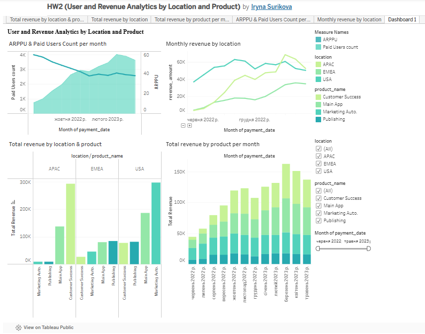

# User and Revenue Analytics by Location and Product  

## Project Overview  
This project was completed as part of my **Data Analytics course**.  
The goal was to analyze user and revenue data across different regions and products using **Tableau** and to build an interactive dashboard for better insights.  

## Objectives  
- Create calculated fields for:  
  - **Total Revenue**  
  - **Paid Users Count**  
  - **ARPPU (Average Revenue Per Paid User)**  
- Build visualizations to analyze revenue and user activity:  
  - **ARPPU & Paid Users Count per month**  
  - **Total Revenue by Location & Product**  
  - **Total Revenue by Product per Month**  
  - **Monthly Revenue by Location**  
- Add interactive **filters (location, product, date)** for all charts.  
- Publish the dashboard on **Tableau Public**.  

## Dashboard Features  
- Compare revenue by product and region.  
- Track revenue dynamics by product and by month.  
- Analyze ARPPU trends alongside paid user growth.  
- Identify regional differences in revenue performance.  
- Fully interactive filters for flexible analysis.  

## Tools & Skills  
- **Tableau Public** – dashboard creation and publishing  
- **Calculated Fields** – metric building (Total Revenue, Paid Users Count, ARPPU)  
- **Data Visualization** – line charts, bar charts, combination charts  
- **Dashboard Design** – layout, interactivity, filters  

## Preview  
  

## Live Dashboard  
[View on Tableau Public](https://public.tableau.com/views/HW2UserandRevenueAnalyticsbyLocationandProduct/Dashboard1?:language=en-US&:sid=&:redirect=auth&:display_count=n&:origin=viz_share_link)  
